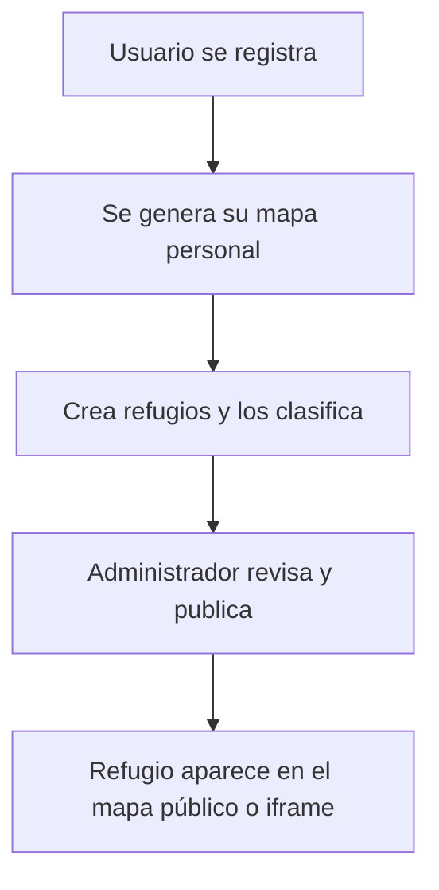

# 🧩 PDA Bullying — Plataforma de Refugios y Recursos contra el Acoso Escolar


> **PDA Bullying** es una aplicación web desarrollada con **Laravel, Vue.js, Vuetify y Leaflet**,  
> que permite registrar, gestionar y visualizar **refugios**: lugares o entidades que ofrecen apoyo a jóvenes víctimas de acoso escolar.

---

## 🎯 Propósito del proyecto

El objetivo principal es **visibilizar recursos de ayuda** y facilitar que docentes, asociaciones o instituciones sociales puedan:
- Registrar un refugio con su información de contacto y ubicación.
- Clasificarlo según el tipo de ayuda que ofrece (educativa, psicológica, social, etc.).
- Validarlo y publicarlo en un **mapa interactivo** accesible al público.

El resultado final es un **mapa vivo de puntos de apoyo**, mantenido de forma colaborativa y gestionado desde un panel web seguro.

---

## 🧩 Estructura funcional

El sistema se compone de tres capas bien diferenciadas:

| Capa | Tecnología | Función principal |
|------|-------------|-------------------|
| **Frontend** | Vue.js + Vuetify | Interfaz de usuario SPA (Single Page Application) |
| **Mapa** | Leaflet 1.6 | Representación geográfica y visualización de refugios |
| **Backend** | Laravel 8.x | API REST, autenticación y persistencia de datos |

---

## 🧠 Flujo funcional básico



1️⃣ El usuario se registra (Laravel Auth / Passport).  
2️⃣ El sistema crea automáticamente un **mapa personal** vinculado a su cuenta.  
3️⃣ El usuario puede **crear, editar o eliminar refugios** y asignarles tipos.  
4️⃣ Un administrador **valida y publica** esos refugios.  
5️⃣ Los refugios públicos se muestran en el **mapa público** o embebido.

---

## ⚙️ Tecnologías utilizadas

| Área | Tecnología | Detalle |
|------|-------------|---------|
| **Framework backend** | Laravel 8.x | Controladores REST, Eloquent ORM, Middleware |
| **Base de datos** | MySQL / MariaDB | Relaciones N:N entre mapas, refugios y tipos |
| **Autenticación** | Laravel Passport | Implementación OAuth2 / JWT |
| **Frontend SPA** | Vue.js 2 + Vuetify | Componentes Material Design y navegación dinámica |
| **Mapas** | Leaflet.js | Visualización interactiva, markers, geolocalización |
| **Compilación assets** | Laravel Mix | Integración con Webpack |
| **Servidor** | Apache / Nginx + PHP-FPM | Despliegue estándar |
| **Estilos** | Vuetify + FontAwesome + Material Icons | UI moderna y coherente |

---

## 📦 Modelos y relaciones principales

| Modelo | Descripción | Relaciones |
|--------|--------------|-------------|
| **User** | Usuario registrado (colaborador o administrador). | 1:1 `Map`, 1:N `Refuge` |
| **Map** | Configuración del mapa del usuario (zoom, centro, visibilidad). | N:N `Refuge`, 1:1 `User` |
| **Refuge** | Lugar o recurso de ayuda. Incluye nombre, descripción, coordenadas y tipo(s). | N:N `Map`, N:N `Type`, 1:1 `User` |
| **Type** | Categoría del refugio (educativo, psicológico, social…). | N:N `Refuge` |

---

## 🔌 API REST disponible

| Método | Ruta | Descripción | Auth |
|--------|------|-------------|------|
| `POST /api/register` | Registro de usuario | ❌ |
| `POST /api/login` | Login (OAuth2 token) | ❌ |
| `GET /api/refuges` | Listado de refugios (públicos o propios) | ✅ |
| `POST /api/refuges` | Creación de refugio | ✅ |
| `PUT /api/refuges/{id}` | Edición de refugio | ✅ |
| `DELETE /api/refuges/{id}` | Eliminación de refugio | ✅ |
| `POST /api/refuges/publish` | Publicar refugio (admin) | 🔒 |
| `POST /api/refuges/hide` | Ocultar refugio (admin) | 🔒 |
| `GET /api/types` | Listar tipos de refugio | ✅ |
| `GET /api/maps/{userId}` | Obtener configuración del mapa | ✅ |

---

## 🗺️ Interfaz de usuario

### 🔹 Mapa público
- Vista principal (`/map` o `/iframe`) renderizada con **Leaflet**.  
- Marcadores dinámicos y popups con información básica del refugio.  
- Filtros por tipo o palabra clave.  
- Tema claro y limpio con Vuetify.

### 🔹 Panel de administración
- `admin/publish.blade.php`: control de publicación de refugios.  
- `admin/type.blade.php`: CRUD de tipos de refugio.  
- `admin/userAdmin.blade.php`: gestión básica de usuarios.

### 🔹 Formularios de autenticación
- Basados en Blade estándar (`login`, `register`, `password reset`, `verify`).  
- Integrados con el sistema de Laravel Auth y Passport.

---

## 🧩 Instalación local

### Requisitos previos
- PHP ≥ 8.1  
- Composer  
- Node.js ≥ 18  
- MySQL o MariaDB

### Pasos
```bash
git clone https://github.com/tuusuario/pda-bullying.git
cd pda-bullying
composer install
npm install
cp .env.example .env
php artisan key:generate
php artisan migrate --seed
php artisan passport:install
npm run dev
php artisan serve
```

---

## 🔐 Seguridad

- Autenticación por **token OAuth2** vía Laravel Passport.  
- Protección CSRF en formularios.  
- Middleware `auth` y `auth:api` para rutas restringidas.  
- Validaciones por Request classes.  
- Roles diferenciados:
  - **Admin:** validación y publicación.  
  - **Usuario registrado:** creación y edición.  
  - **Visitante:** acceso de solo lectura al mapa público.

---

## 📊 Buenas prácticas aplicadas

- Estructura Laravel estándar: `routes/api.php`, `controllers/`, `models/`, `resources/views/`.  
- Uso de **Eloquent** con relaciones Many-to-Many y One-to-One.  
- Separación entre vistas Blade (autenticación/admin) y SPA (app principal).  
- Frontend compilado con Laravel Mix (JS/CSS versionado).  
- Componentes Vue modulares (`app-container`, `iframe-component`, `crudtype-component`, etc.).  
- Gestión centralizada de assets y dependencias.

---

## 🚀 Roadmap

| Fase | Objetivo | Estado |
|------|-----------|--------|
| **1️⃣ MVP** | CRUD de refugios, tipos y usuarios | ✅ |
| **2️⃣ Mapa público** | Leaflet integrado + iframe | ✅ |
| **3️⃣ Roles y publicación** | Moderación por admin | ✅ |
| **4️⃣ Filtros avanzados** | Búsqueda por tipo, texto o zona | 🚧 |
| **5️⃣ Métricas y dashboard** | Estadísticas de cobertura | 🔜 |
| **6️⃣ Internacionalización** | i18n y soporte multilingüe | 🔜 |

---

## 🧑‍💻 Créditos técnicos

| Rol | Tecnología |
|------|-------------|
| Backend | Laravel 8, Eloquent ORM, Passport |
| Frontend | Vue.js, Vuetify |
| Mapas | Leaflet 1.6 |
| Base de datos | MySQL / MariaDB |
| Estilos | Material Icons, FontAwesome |
| Autenticación | Laravel Passport |
| Infraestructura | Apache/Nginx + PHP-FPM |

---

## 🏛️ Licencia

**MIT License**  
El proyecto puede usarse, modificarse y redistribuirse libremente con atribución.  
> PDA Bullying se construyó con herramientas abiertas para apoyar causas abiertas:  
> **conocimiento, comunidad y prevención.**
